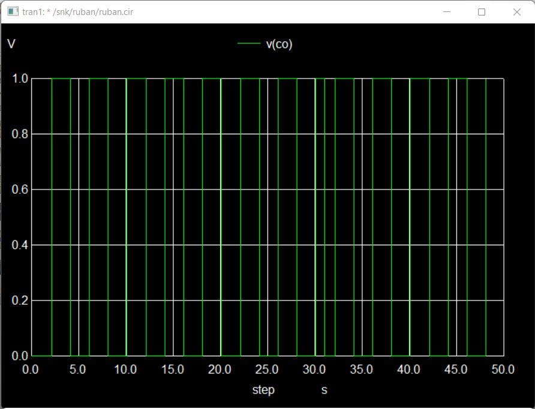
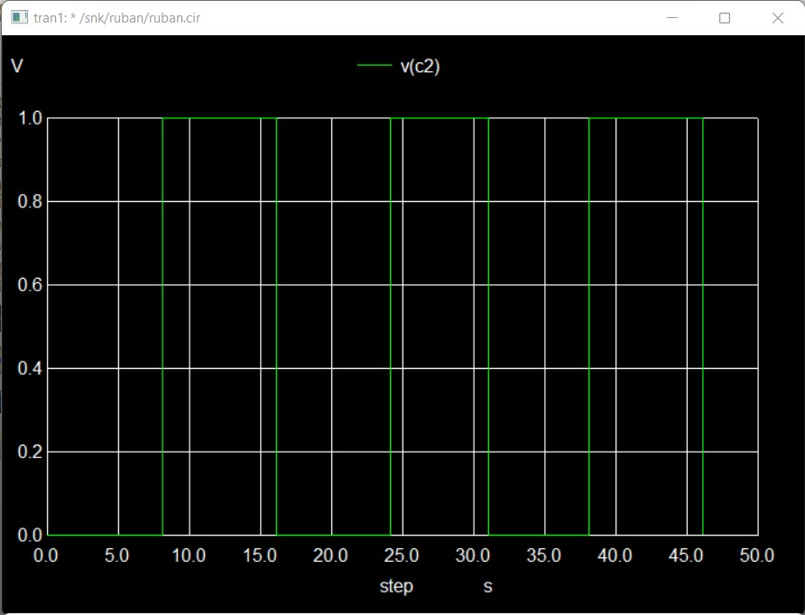
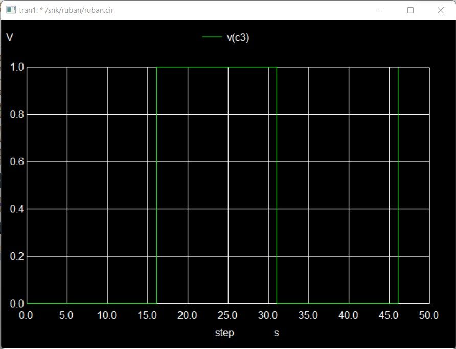

</br>

# Implementation of Cmos Buffer Along With Mod-16 Counter for Counting Based Data Line Selection Operation
</br>


</br>


This repository gives a detailed report on the design of a Implementation of Cmos Buffer Along With Mod-16 Counter for Counting Based Data Line Selection Operation using open-source EDA tools and skywater130nm PDK . The simulation being carried out is in mixed-mode (i.e.) both analog and digital simulation. Later the obtained simulation, is verified for it's correctness and functionality.

 
<br>

#  Table of Contents

* [Introduction](#-Introduction) 
* [Implementation of Cmos Buffer Along With Mod-16 Counter for Counting Based Data Line Selection Operation](#-Cmos-Buffer-Along-With-Multiplexer-with-Adder/Subtractor-for-Signal-Shaping-Operation)
* [Software Tools Used](#-Software-Tools-Used) 
* [Implemented Circuit Design using eSim](#-Implemented-Circuit-Design-using-eSim) 
    * [Schematics](#-Schematics) 
    * [Verilog_codes](#-Verilog-codes)
* [Resultant Waveforms](#-Resultant-Waveforms) 
* [Netlist](#-Netlist)
* [Author](#-Author)
* [Acknowledgements](#-Acknowledgements)


<br>

# 📝 Introduction

 An  sine  wave  generator  along  with cmos  buffer  is  used  to  generate  signals. The output from the cmos buffer is fed to a Mod-16 counter. The counter counts from 0 to 15 and resets once the count increases to 16. the four bit output from the Mod-16 counter is fed into a 16x1 Mux, and the data fed to the Mux are selected sequencially from first to last and this process is repeated until the input sine wave is stopped.

 
 </br>

*[Back To Top](#-Table-of-Contents)* ⤴️ 

</br>

# 📝 Implementation of Cmos Buffer Along With Mod-16 Counter for Counting Based Data Line Selection Operation


Sine  wave  is  generated  passed  to  cmos  buffer to generate signals. A buffer is a circuit that is used tp provide current gain but no voltage gain. The output of the buffer can provide more current, without changing the output voltage. The output is fed to the Mod-16 counter. A Mod-16 counter is a simple counter like any other normal counter except for that the count resets each time when the count reaches 16. The output of the Mod-16 counter is a four bit binary representation of the count value. This output is fed to a 16x1 multiplexer. Multiplexer is a combinational circuit which has maximum of 2n data inputs, ‘n’ selection lines and single output line. Among these data inputs only one will be connected to the output based on the select line values. So, a 16x1 mux have 16 data input lines, 4 select lines and one output line. So, based on the output of input signals the corresponding data line is connected to the output line. So when the input sine wave is fed, with the modified signal from the CMOS buffer the counter counts from 0 to 15 repeatedly and hence the data in the datalines are seqenctially made available in the output of the Multiplexer for the Time period (of the input sine wave). This circuit can be used for the sequential access of the data periodically.

# Software Tools Used

<br>

* eSim 

  * eSim is a free and open-sourced EDA tool for circuit design, simulation, analysis and PCB design. It is an integrated tool built using free/libre and open source software such as KiCad, Ngspice, Verilator, makerchip-app, sandpiper-saas and GHDL. eSim is released under GPL.
  
   🔗 https://esim.fossee.in/home


* KiCad

 * KiCad's Schematic Editor supports everything from the most basic schematic to a complex hierarchical design with hundreds of sheets. It helps to create our own custom symbols or use some of the thousands found in the official KiCad library. We can verify our design with integrated SPICE simulator and electrical rules checker.
    
   🔗 https://www.kicad.org/

* Ngspice

 *  Ngspice is a mixed-level/mixed-signal electronic circuit simulator. Ngspice implements three classes of analysis: nonlinear DC analyses, Nonlinear transient analyses, linear AC analyses.

   🔗 http://ngspice.sourceforge.net/
   
* Verilator

 *  Verilator is a free and open-source software tool which converts Verilog code to a cycle-accurate behavioral model in C++ or SystemC.

   🔗 https://www.veripool.org/verilator/
   
* Makerchip

 *  A web-based IDE that is used to design and simulate digital circuits using Verilog, and the language extension of Verilog, TL-Verilog.

   🔗   https://www.makerchip.com/
   
* Skywater PDK

  * The SKY130 is a mature 180nm-130nm hybrid technology originally developed internally by Cypress Semiconductor before being spun out into SkyWater Technology and made accessible to general industry. SkyWater and Google’s collaboration is now making this technology accessible to everyone.

  * The SKY130 Process Node is an extremely flexible offering, including many normally optional features as standard (features like the local interconnect, SONOS functionality, MiM capacitors, and more). This provides the designer with a wide range of flexibility in design choices
   
   
   
 

</br>

*[Back To Top](#-Table-of-Contents)* ⤴️ 

</br>


# 📝 Implemented Circuit Design using eSim

## 📋 Schematics

The Schematic: 


Skymode block


## 📋 Verilog Codes

- The digital block is the *ruban_counter.v* which is built using the following verilog code
```verilog
module ruban_counter (clk,rst,count);

input clk,rst;
output reg[3:0] count;

always @ (posedge clk , posedge rst ) begin
	if (rst)
		count <= 0;
	else
		count <= count+1;
	end
endmodule


- The digital block is the *ruban_mux.v* which is built using the following verilog code
```verilog
module ruban_mux (input wire[15:0] in, input wire[3:0] s, output reg out);

always @ (1)
case(s)

	0 : out = in[0];
	1 : out = in[1];
	2 : out = in[2];
	3 : out = in[3];
	4 : out = in[4];
	5 : out = in[5];
	6 : out = in[6];
	7 : out = in[7];
	8 : out = in[8];
	9 : out = in[9];
	10: out = in[10];
	11: out = in[11];
	12: out = in[12];
	13: out = in[13];
	14: out = in[14];
	15: out = in[15];
endcase
endmodule


```


# 📝 Resultant Waveforms

Resultant waveform of Signal Generation


Resultant waveform of CMOS Buffer:


Resultant waveforms of MOD-16 counter:








Resultant waveform of Final Output from Multiplexer:


</br>

*[Back To Top](#-Table-of-Contents)* ⤴️ 

</br>

# 📝 Netlist

The Netlist for the designed circuit is generated after simulating the circuit.

```
* /snk/ruban/ruban.cir

.include "C:\FOSSEE\eSim\library\sky130_fd_pr\models\sky130_fd_pr__model__diode_pd2nw_11v0.model.spice"
.include "C:\FOSSEE\eSim\library\sky130_fd_pr\models\sky130_fd_pr__model__linear.model.spice"
.lib "C:\FOSSEE\eSim\library\sky130_fd_pr\models\sky130.lib.spice" tt
.include "C:\FOSSEE\eSim\library\sky130_fd_pr\models\sky130_fd_pr__model__inductors.model.spice"
.include "C:\FOSSEE\eSim\library\sky130_fd_pr\models\sky130_fd_pr__model__r+c.model.spice"
.include "C:\FOSSEE\eSim\library\sky130_fd_pr\models\sky130_fd_pr__model__diode_pw2nd_11v0.model.spice"
.include "C:\FOSSEE\eSim\library\sky130_fd_pr\models\sky130_fd_pr__model__pnp.model.spice"
xsc2 net-_sc1-pad1_ vin gnd gnd sky130_fd_pr__nfet_01v8 
xsc1 net-_sc1-pad1_ vin net-_sc1-pad3_ net-_sc1-pad3_ sky130_fd_pr__pfet_01v8 
xsc3 buf_out net-_sc1-pad1_ net-_sc1-pad3_ net-_sc1-pad3_ sky130_fd_pr__pfet_01v8 
xsc4 buf_out net-_sc1-pad1_ gnd gnd sky130_fd_pr__nfet_01v8 
v1  vin gnd sine(0 5 .5 0 0)
v2  mux1 gnd sine(0 5 2 0 0)
v4  mux2 gnd sine(0 5 4 0 0)
v5  mux3 gnd pulse(0 5 0 0 0 1 2)
v6 mux4 gnd  dc 5
v3  net-_u2-pad2_ gnd pulse(5 0 1 0 0 30 30)
* u2  buf_out net-_u2-pad2_ net-_u1-pad1_ net-_u1-pad2_ adc_bridge_2
* u5  mux4 mux2 mux1 mux3 mux3 mux3 mux2 gnd net-_u3-pad9_ net-_u3-pad10_ net-_u3-pad11_ net-_u3-pad12_ net-_u3-pad13_ net-_u3-pad14_ net-_u3-pad15_ net-_u3-pad16_ adc_bridge_8
* u4  mux1 gnd mux2 mux1 mux2 mux1 mux4 gnd net-_u3-pad1_ net-_u3-pad2_ net-_u3-pad3_ net-_u3-pad4_ net-_u3-pad5_ net-_u3-pad6_ net-_u3-pad7_ net-_u3-pad8_ adc_bridge_8
* s c m o d e
* u7  out plot_v1
* u6  net-_u3-pad21_ out dac_bridge_1
v7 net-_sc1-pad3_ gnd  dc 5
* u3  net-_u3-pad1_ net-_u3-pad2_ net-_u3-pad3_ net-_u3-pad4_ net-_u3-pad5_ net-_u3-pad6_ net-_u3-pad7_ net-_u3-pad8_ net-_u3-pad9_ net-_u3-pad10_ net-_u3-pad11_ net-_u3-pad12_ net-_u3-pad13_ net-_u3-pad14_ net-_u3-pad15_ net-_u3-pad16_ c3 c2 c1 co net-_u3-pad21_ ruban_mux
* u1  net-_u1-pad1_ net-_u1-pad2_ c3 c2 c1 co ruban_counter
* u8  vin plot_v1
* u9  buf_out plot_v1
* u10  c3 plot_v1
* u13  co plot_v1
* u11  c2 plot_v1
* u12  c1 plot_v1
a1 [buf_out net-_u2-pad2_ ] [net-_u1-pad1_ net-_u1-pad2_ ] u2
a2 [mux4 mux2 mux1 mux3 mux3 mux3 mux2 gnd ] [net-_u3-pad9_ net-_u3-pad10_ net-_u3-pad11_ net-_u3-pad12_ net-_u3-pad13_ net-_u3-pad14_ net-_u3-pad15_ net-_u3-pad16_ ] u5
a3 [mux1 gnd mux2 mux1 mux2 mux1 mux4 gnd ] [net-_u3-pad1_ net-_u3-pad2_ net-_u3-pad3_ net-_u3-pad4_ net-_u3-pad5_ net-_u3-pad6_ net-_u3-pad7_ net-_u3-pad8_ ] u4
a4 [net-_u3-pad21_ ] [out ] u6
a5 [net-_u3-pad1_ net-_u3-pad2_ net-_u3-pad3_ net-_u3-pad4_ net-_u3-pad5_ net-_u3-pad6_ net-_u3-pad7_ net-_u3-pad8_ net-_u3-pad9_ net-_u3-pad10_ net-_u3-pad11_ net-_u3-pad12_ net-_u3-pad13_ net-_u3-pad14_ net-_u3-pad15_ net-_u3-pad16_ ] [c3 c2 c1 co ] [net-_u3-pad21_ ] u3
a6 [net-_u1-pad1_ ] [net-_u1-pad2_ ] [c3 c2 c1 co ] u1
* Schematic Name:                             adc_bridge_2, NgSpice Name: adc_bridge
.model u2 adc_bridge(in_low=1.0 in_high=2.0 rise_delay=1.0e-9 fall_delay=1.0e-9 ) 
* Schematic Name:                             adc_bridge_8, NgSpice Name: adc_bridge
.model u5 adc_bridge(in_low=1.0 in_high=2.0 rise_delay=1.0e-9 fall_delay=1.0e-9 ) 
* Schematic Name:                             adc_bridge_8, NgSpice Name: adc_bridge
.model u4 adc_bridge(in_low=1.0 in_high=2.0 rise_delay=1.0e-9 fall_delay=1.0e-9 ) 
* Schematic Name:                             dac_bridge_1, NgSpice Name: dac_bridge
.model u6 dac_bridge(out_low=0.0 out_high=5.0 out_undef=0.5 input_load=1.0e-12 t_rise=1.0e-9 t_fall=1.0e-9 ) 
* Schematic Name:                             ruban_mux, NgSpice Name: ruban_mux
.model u3 ruban_mux(rise_delay=1.0e-9 fall_delay=1.0e-9 input_load=1.0e-12 instance_id=1 ) 
* Schematic Name:                             ruban_counter, NgSpice Name: ruban_counter
.model u1 ruban_counter(rise_delay=1.0e-9 fall_delay=1.0e-9 input_load=1.0e-12 instance_id=1 ) 
.tran 0.001e-00 50e-00 0e-00

* Control Statements 
.control
run
print allv > plot_data_v.txt
print alli > plot_data_i.txt
plot v(out) v(vin)+25 v(buf_out)+10
plot v(c3)
plot v(co)
plot v(c2)
plot  v(c1)
.endc
.end


```
</br>

*[Back To Top](#-Table-of-Contents)* ⤴️ 

</br>


# Author
 
 🖊️ Rubankumar D, Second year student, B.E. ECE, Madras Institute of Technology, Anna University, Chennai, India
 
 
#  Acknowledgements

 📖 Kunal Ghosh, Co-Founder of VLSI System Design (VSD) Corp. Pvt. Ltd. - kunalpghosh@gmail.com
 
 📖 Sumanto Kar, eSim Team, FOSSEE
 
 📖 FOSSEE, IIT Bombay
